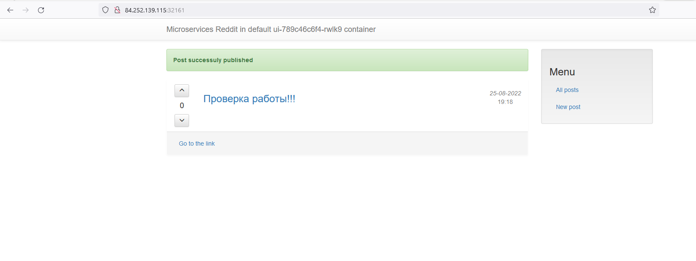

# zmd73_microservices

### Лекция 15
#### 15.1 Работа с контейнерами
Создание и запуск контейнера:
```
docker run <image>
```
Список запущенных контейнеров:
```
docker ps
```
Запуск процесса в контейнере:
```
docker exec -it <u_container_id> bash
```
Создание image из работающего контейнера:
```
docker commit <u_container_id> yourname/ubuntu-tmp-file
```
Удаление контейнеров и образов:
```
docker rm $(docker ps -a -q) # удалит все незапущенные контейнеры

docker rmi $(docker images -q)
```
#### 15.2 Задание со *
Docker image - это неизменяемый файл, содержащий исходный код, библиотеки, зависимости, инструменты и другие файлы, необходимые для запуска приложения. Docker container - это экземпляр image, содержащий новый слой доступный для записи и ряд настроек характерных для работающей машины, например NetworkSettings.

### Лекция 16
#### 16.1 Запуск контейнера на удаленной машине
> **WARNING**:Docker-machine deprecated.
Установка docker-machine на linux:
```
curl -L https://github.com/docker/machine/releases/download/v0.16.2/docker-machine-`uname -s`-`uname -m` >/tmp/docker-machine && chmod +x /tmp/docker-machine && sudo cp /tmp/docker-machine /usr/local/bin/docker-machine
```
Установка docker на удаленный хост:
```
docker-machine create \
--driver generic \
--generic-ip-address=<external_ip> \
--generic-ssh-user yc-user \
--generic-ssh-key ~/.ssh/appuser.pub \
docker-host
```
Сборка и запуск образа на удаленном хосте:
```
eval $(docker-machine env docker-host)
cd docker-momolith
docker build -t reddit:latest .
docker run --name reddit -d --network=host reddit:latest
```
Загрузка образа в DockerHub
```
docker login
docker tag reddit:latest <your-login>/otus-reddit:1.0
docker push <your-login>/otus-reddit:1.0
```

#### 16.2 Задание со *
Для использования провайдеров с зеркал нужно создать файл `vi ~/.terraformrc` и записать:
```
provider_installation {
  network_mirror {
    url = "https://terraform-mirror.yandexcloud.net/"
    include = ["registry.terraform.io/*/*"]
  }
  direct {
    exclude = ["registry.terraform.io/*/*"]
  }
}
```
Установка роли для установки Docker:
```
cd docker-monolith/infra/ansible
ansible-galaxy install -r requrements.yml -p ./roles
```
Создание образа с установленным докером:
```
cd ../packer
packer build -var-file=variables.json docker.json
```
Создание ВМ с использованием образа (колличество ВМ можно менять параметром **count_vm**):
```
cd docker-monolith/infra/terraform
terraform init
terraform apply
cd ./prod
terraform init -backend-config=./backend.conf
terraform apply
```
Запуск конетейнера на ВМ:
```
ansible-playbook playbooks/start_container.yml
```
### Лекция 17
#### 17.1 Создание и запуск связанных контейнеров
Build, создание сети reddit и запуск связанных контейнеров:
```
docker build -t ayden1st/post:1.0 ./post-py
docker build -t ayden1st/comment:1.0 ./comment
docker build -t ayden1st/ui:1.0 ./ui
docker pull mongo:latest
docker network create reddit
docker run -d --network=reddit --network-alias=post_db --network-alias=comment_db mongo:latest
docker run -d --network=reddit --network-alias=post ayden1st/post:1.0
docker run -d --network=reddit --network-alias=comment ayden1st/comment:1.0
docker run -d --network=reddit -p 9292:9292 ayden1st/ui:1.0
```
#### 17.2 Задание со *
Запуск контейнеров с параметрами env, переопредящие параметры заданные в Dockerfile:
```
docker run -d --network=reddit --network-alias=post_db_new --network-alias=comment_db_new mongo:latest
docker run -d --network=reddit --network-alias=post_new \
  -e POST_DATABASE_HOST='post_db_new' \
  ayden1st/post:1.0
docker run -d --network=reddit --network-alias=comment_new \
  -e COMMENT_DATABASE_HOST='comment_db_new' \
  ayden1st/comment:1.0
docker run -d --network=reddit -p 9292:9292 \
  -e POST_SERVICE_HOST='post_new' \
  -e COMMENT_SERVICE_HOST='comment_new' \
  ayden1st/ui:1.0
```
#### 17.3 Задание со *
Оптимизированные образы в файлах Dockerfile.1
* Использованы alpine образы
* Очищается кеш установщиков pip, apk
```
REPOSITORY         TAG                IMAGE ID       CREATED              SIZE
ayden1st/ui        3.0                db2ad76145e1   About a minute ago   91.6MB
ayden1st/post      2.0                ca124214c3be   19 minutes ago       64.8MB
ayden1st/comment   2.0                9c9df1e44931   44 minutes ago       89MB
ayden1st/ui        2.0                d022e4e0dea8   About an hour ago    432MB
ayden1st/post      1.0                12a27f67be5d   2 hours ago          121MB
ayden1st/ui        1.0                cfbc38f21173   3 hours ago          762MB
ayden1st/comment   1.0                a4b332da83e1   3 hours ago          759MB
```
Build и запуск коннтейнеров с оптимизированными образами:
```
docker build -t ayden1st/post:2.0 -f ./post-py/Dockerfile.1 ./post-py
docker build -t ayden1st/comment:2.0 -f ./comment/Dockerfile.1 ./comment
docker build -t ayden1st/ui:3.0 -f ./ui/Dockerfile.1 ./ui
docker run -d --network=reddit --network-alias=post_db \
--network-alias=comment_db -v reddit_db:/data/db mongo:latest
docker run -d --network=reddit --network-alias=post ayden1st/post:2.0
docker run -d --network=reddit --network-alias=comment ayden1st/comment:2.0
docker run -d --network=reddit -p 9292:9292 ayden1st/ui:3.0
```
#### 17.4 Использование volume
Создание volume и запуск контейнеров с его использованием:
```
docker volume create reddit_db
docker run -d --network=reddit --network-alias=post_db \
--network-alias=comment_db -v reddit_db:/data/db mongo:latest
docker run -d --network=reddit --network-alias=post ayden1st/post:1.0
docker run -d --network=reddit --network-alias=comment ayden1st/comment:1.0
docker run -d --network=reddit -p 9292:9292 ayden1st/ui:2.0
```
Остановка и удаление контейнеров:
```
docker kill $(docker ps -q)
docker container prune
```
### Лекция 18
#### 18.1 Docker и сети
Запуск контейнеров с несколькими сетями:
```
docker network create back_net --subnet=10.0.2.0/24
docker network create front_net --subnet=10.0.1.0/24
docker run -d --network=front_net -p 9292:9292 --name ui ayden1st/ui:1.0
docker run -d --network=back_net --name comment ayden1st/comment:1.0
docker run -d --network=back_net --name post ayden1st/post:1.0
docker run -d --network=back_net --name mongo_db \
  --network-alias=post_db --network-alias=comment_db mongo:latest
docker network connect front_net post
docker network connect front_net comment
```
#### 18.2 Docker-compose
Добавлены переменные окружения:
* Логин пользователя в DockerHub
* Порт приложения
* Версия приложений
* Имя проекта
Базовое имя проекта в docker-compose берется из имени папки в которой находится файл docker-compose. Изменить можно задав переменную env COMPOSE_PROJECT_NAME или запустив docker-compose с флагом -p <NAME>.
#### 18.3 Задание со *
Файл docker-compose.override.yml добавлены:
* Монтирование папки приложения в контейнер (работает на локальной машине)
* Добавлена опция command переопределяющая запуск puma с отличными от образа дополнительными параметрами `--debug -w 2`
### Лекция 20
#### 20.1 Установка gitlab-ce в контейнере
Созданы манифест terraform для развертывания ВМ и плейбук ansible для установки docker и запуска контейнеров gitlab-ce, gitlab-runner. Пароль root хранится в контейнере:
```
sudo docker exec -it gitlab grep 'Password:' /etc/gitlab/initial_root_password
```
Для регистрации runner нужно запустить комманду в контейнере:
```
sudo docker exec -it gitlab-runner gitlab-runner register \
--url http://<external_ip>/ \
--non-interactive \
--locked=false \
--name DockerRunner \
--executor docker \
--docker-image alpine:latest \
--registration-token <TOKEN> \
--tag-list "linux,xenial,ubuntu,docker" \
--run-untagged
```
#### 20.1 Задание со *
Установка gitlab-ce и gitlab-runner:
```
cd gitlab-ci/infra/terraform
terraform init
terraform apply
cd ../ansible
ansible-playbook playbook/install_docker.yml
```
Для сборки образа docker, runner должен иметь доступ к docker.socket:
```
docker exec -it gitlab-runner gitlab-runner register --url http://<external_ip>/ --non-interactive --locked=false --name DockerRunner --executor docker --docker-image alpine:latest --registration-token <TOKEN> --tag-list "linux,xenial,ubuntu,docker" --run-untagged --docker-volumes "/var/run/docker.sock:/var/run/docker.sock"
```
В пайплайн добавлены build_container_reddit для сборки образа, branch_review для запуска контейнера, clear_review для удаления контенера.
[Ссылка](https://devops-team-otus.slack.com/archives/C03706PRZU6) на канал в Slack

### Лекция 22
#### 22.1 Мониторинг с Prometheus
Созданы Dockerfile и конфигурация Prometheus.
Команда для сборки всех образов приложений:
```
export USER_NAME=username
for i in ui post-py comment; do cd src/$i; bash docker_build.sh; cd -; done
```
Отредактирован файл docker-compose.yml для запуска контейненеров с Prometheus. Убраны команды build, Добавлены network aliases.
Контейнеры загружены в [DockerHub](https://hub.docker.com/u/ayden1st).
#### 22.2 Задания со *
Добален мониторинг БД с помощью percona/mongodb_exporter.
Добален мониторинг Blackbox.
Создан Makefile для сборки и отправки образов.

### Лекция 25
#### 25.1 Сбор логов из Docker-контейнеров в EFK
Для сборов логов из Docker-контейнеров используется стек Elasticsearch-Fluentd-Kibana (EFK)
Стек запускается через docker-compose `docker/docker-compose-logging.yml`. Конетейнер с конфигурацией Fluentd собирается из Dockerfile в `logging/fluentd`.
Сборка конейнеров приложений:
```
export USER_NAME='логин на Docker Hub'
cd ./src/ui && bash docker_build.sh && docker push $USER_NAME/ui
cd ../post-py && bash docker_build.sh && docker push $USER_NAME/post
cd ../comment && bash docker_build.sh && docker push $USER_NAME/comment
```
Запуск EFK и приложения (выставить переменные среды в .env):
```
cd logging/fluentd/
docker build -t $USER_NAME/fluentd .
cd ../../docker/
docker-compose -f docker-compose-logging.yml up -d
docker-compose -f docker-compose.yml up -d
```
В конфигурацию Fluentd добавлены фильтры для структурированных логов приложения `post` и фильтры с grok для неструктурированных логов приложения `ui`. Использовался обновленный сиснтаксис плагина [fluent-plugin-grok-parser](https://github.com/fluent/fluent-plugin-grok-parser)
В docker-compose приложения добавлены environment переменные.
#### 25.2 Сбор трейсов с Zipkin
Для сбора трейсов добавляем контейнер zipkin в `docker/docker-compose-logging.yml`, отправка трейсов в приложениях включается env-переменной ZIPKIN_ENABLED. Добавляем сети приложений в `docker/docker-compose-logging.yml` для доступа приложений к контейнеру.
#### 25.3 Задание со *
Фильтр неструктурированных логов приложения `ui`:
```
<filter service.ui>
  @type parser
  key_name message
  format grok
  <parse>
    @type grok
    <grok>
      pattern service=%{WORD:service} \| event=%{WORD:event} \| path=%{URIPATHPARAM:request} \| request_id=%{GREEDYDATA:request_id} \| remote_addr=%{IP:client} \| method=.%{WORD:method} \| response_status=%{NUMBER:response_status}
    </grok>
  </parse>
  reserve_data true
</filter>
```
Собраны контейнеры с тегом bug. Анализ трейсов в Zipkin показал, что большая задержка в 3 сек. происходит при обращении к сервису `post` span `db_find_single_post`. В коде функции find_post есть задержка исполнения time.sleep(3).

### Лекция 28
#### 28.1 Установка k8s на виртуальных машинах
Установка Docker на ubuntu 18.04:
```
sudo apt update && sudo apt install -y apt-transport-https ca-certificates curl software-properties-common
curl -fsSL https://download.docker.com/linux/ubuntu/gpg | sudo apt-key add -
sudo add-apt-repository "deb [arch=amd64] https://download.docker.com/linux/ubuntu bionic stable"
sudo apt update && sudo apt install -y docker-ce=5:19.03.15~3-0~ubuntu-bionic docker-ce-cli=5:19.03.15~3-0~ubuntu-bionic
```
Установка k8s на ubuntu 18.04:
```
sudo apt-get update && sudo apt-get install -y apt-transport-https ca-certificates curl
sudo curl -fsSLo /usr/share/keyrings/kubernetes-archive-keyring.gpg https://packages.cloud.google.com/apt/doc/apt-key.gpg
echo "deb [signed-by=/usr/share/keyrings/kubernetes-archive-keyring.gpg] https://apt.kubernetes.io/ kubernetes-xenial main" | sudo tee /etc/apt/sources.list.d/kubernetes.list
sudo apt-get update && sudo apt install -y kubelet=1.19.16-00 kubeadm=1.19.16-00 kubectl=1.19.16-00
sudo apt-mark hold kubelet kubeadm kubectl
```
Иннициализация мастер-ноды на первом хосте:
```
sudo kubeadm init --apiserver-cert-extra-sans=<external-master-ip> \
  --apiserver-advertise-address=0.0.0.0 \
  --control-plane-endpoint=<external-master-ip> \
  --pod-network-cidr=10.244.0.0/16
```
Добавление в кластер воркер-ноды на втором хосте:
```
kubeadm join <external-master-ip>:6443 --token <token> \
    --discovery-token-ca-cert-hash sha256:<cert-hash>
```
Для управления кластером через kubectl нужно скопировать `config` с мастер-ноды
На самом хосте:
```
mkdir -p $HOME/.kube
sudo cp -i /etc/kubernetes/admin.conf $HOME/.kube/config
sudo chown $(id -u):$(id -g) $HOME/.kube/config
```
на удаленном хосте:
```
scp ubuntu@<external-master-ip>:~/.kube/config ~/.kube/config
```
Инофрмация о нодах можно получить командой:
```
kubectl get nodes
```
#### 28.2 Установка CNI плагина calico
Для установки CNI плагина calico нужно применить манифест в k8s.
[Манифест](https://projectcalico.docs.tigera.io/manifests/calico.yaml) по ссылке из офф [документации](https://projectcalico.docs.tigera.io/getting-started/kubernetes/self-managed-onprem/onpremises#install-calico-with-kubernetes-api-datastore-more-than-50-nodes) при применении вызывает ошибку:
```
unable to recognize "calico.yaml": no matches for kind "PodDisruptionBudget" in version "policy/v1"
```
Скачаем альтернативную версию манифеста:
```
curl https://docs.projectcalico.org/v3.20/manifests/calico.yaml -O
```
Раскоменнтируем `CALICO_IPV4POOL_CIDR` и определим `10.244.0.0/16`.
Применим:
```
kubectl apply -f calico.yaml
```
Все ноды переходят в READY статус.
#### 28.3 Применение манифестов приложения reddit
Применим манифесты всех компонентов reddit
```
cd kubernetes/reddit
kubectl apply -f mongo-deployment.yml
kubectl apply -f post-deployment.yml
kubectl apply -f comment-deployment.yml
kubectl apply -f ui-deployment.yml
kubectl get pods -w
```
#### 28.4 Задание со *
В директории `terraform` и `ansible` добавлены манифесты и плейбуки для установки кластера.
Установку можно запустить командой из корня репозитория:
```
make install_k8s
```
### Лекция 30
#### 30.1 Minikube, context
Запуск minikube с драйвером virtualbox:
```
minikube start --driver=virtualbox
```
*Context* конфигурация для подключения к кластеру Kubernetes, расположен в `~/.kube/config.
Задать *context*:
```
kubectl config set-cluster ... cluster_name
kubectl config set-credentials ... user_name
kubectl config set-context context_name \
  --cluster=cluster_name \
  --user=user_name
```
Выбрать *context*:
```
kubectl config use-context context_name
```
Текущий *context*:
```
kubectl config current-context
```
Все имеющиеся *context*:
```
kubectl config get-contexts
```
Включить и открыть dashboard в minikube:
```
minikube dashboard
```
#### 30.2 Yandex Cloud Managed Sevice for Kubernetes
Получить *context* кластера Managed Kubernetes в Yandex Cloud:
```
yc managed-kubernetes cluster get-credentials <cluster-name> --external
```
Запуск манифестов:
```
kubectl apply -f ./kubernetes/reddit/dev-namespace.yml
kubectl apply -f ./kubernetes/reddit/ -n dev
```
Узнать адреса нод и порт сервиса приложения:
```
kubectl get nodes -o wide
kubectl describe service ui -n dev | grep NodePort
```


#### 30.3 Задание со *
[Зеркало документации](https://registry.tfpla.net/providers/yandex-cloud/yandex/latest/docs/resources/kubernetes_cluster) по провайдеру Yandex Cloud.
В директории 'kubernetes/terraform_yc_mk8s' манифест для развертывания кластера Managed Service for Kubernetes в Yandex Cloud.
Запуск:
```
make install_yc_mk8s
```
[Документация](https://kubernetes.io/docs/tasks/access-application-cluster/web-ui-dashboard/) по установке дашборда в кластер Kubernetes.
Применение манифестов, создание токена, запуск proxy:
```
kubectl apply -f https://raw.githubusercontent.com/kubernetes/dashboard/v2.5.0/aio/deploy/recommended.yaml
kubectl apply -f ./kubernetes/dashboard/admin-user.yml
kubectl apply -f ./kubernetes/dashboard/cluster-role.yml
kubectl -n kubernetes-dashboard create token admin-user
kubectl proxy
```
Перейти по [ссылке](http://localhost:8001/api/v1/namespaces/kubernetes-dashboard/services/https:kubernetes-dashboard:/proxy/) и зайти по полученному токену.
> **WARNING**: Пользователь с правами admin.
Удаление:
```
kubectl -n kubernetes-dashboard delete serviceaccount admin-user
kubectl -n kubernetes-dashboard delete clusterrolebinding admin-user
```
